# Casa Maiz

A React Native CLI app, TypeScript throughout, that renders the Casa Maiz guest
experience — Home, Menu, Privacy, navigation, alerts, notices and app-update
gating — entirely from the published Payload CMS contract (v1.1). Nothing
editorial is hardcoded.

> **Reviewing this submission?** [**Architecture and trade-offs**](docs/ARCHITECTURE.md) ·
> [**Setup**](docs/SETUP.md) · [**Testing**](docs/TESTING.md) ·
> [**Limitations**](docs/LIMITATIONS.md)

## Demo

<p align="center">
  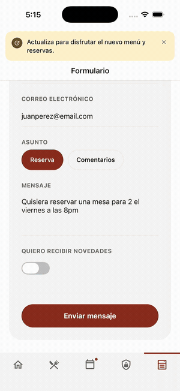
</p>

> 🎬 Prefer video? [Watch the MP4](docs/media/demo.mp4)

## Both platforms

Same content contract, deliberately different chrome: a real
`UIVisualEffectView` behind the iOS tab bar, Material tonal surfaces and
elevation on Android.

| Home | Menu | Privacy | Reservations | CMS form | Dark |
|:---:|:---:|:---:|:---:|:---:|:---:|
| 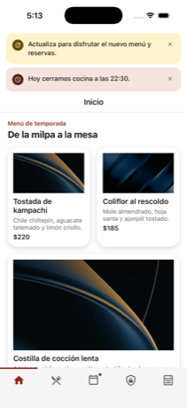 | 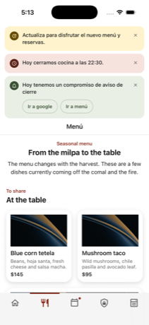 | 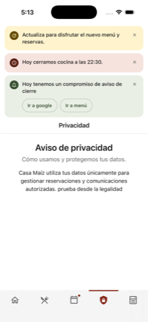 | 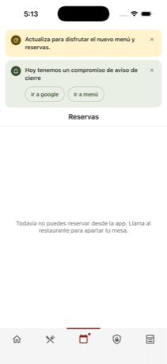 | 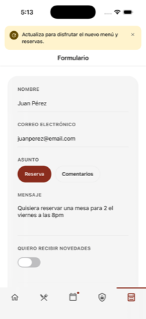 | 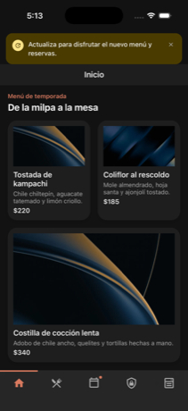 |
| 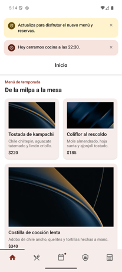 | 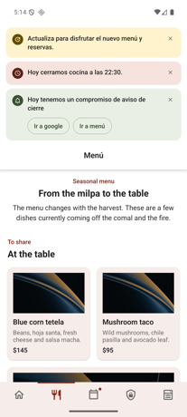 | 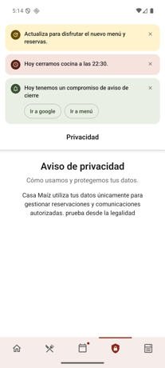 | 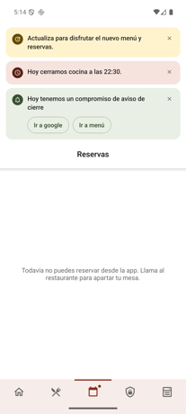 | 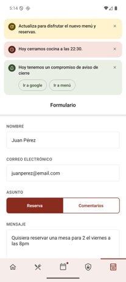 | 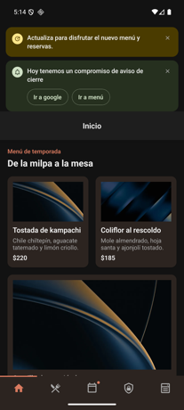 |

*Top row iOS, bottom row Android.*

Dark mode follows system appearance. Debug builds also carry a gear in the
top-right of the dev-only **Form (dev)** tab that flips the scheme in place, so
it can be seen without leaving the app for system settings. Release builds,
including the downloadable APK below, have neither the tab nor the gear.

## Requirements coverage

Every core requirement in the assessment, and where it lives:

| # | Requirement | Where |
|---|---|---|
| 1 | Foundation with clear boundaries, configurable base URL | `src/core`, `src/data`, `src/presentation` ([layout](docs/ARCHITECTURE.md)) |
| 2 | Typed CMS client: four context params, `Platform.OS`, installed version, contract 1.1, media URLs, dedupe, cancellation | `core/contract/deliveryContext.ts`, `core/transport/client.ts`, `data/remote/` |
| 3 | Block registry rendering every live Home and Menu block; unknown blocks fail safe | `presentation/blocks/registry.tsx` |
| 4 | Bootstrap as configuration: navigation, promotions, feature flags, operational notice, update gate, alerts with placement/trigger/frequency/dismissal/targeting | `data/logic/`, `presentation/banners/` |
| 5 | Navigation from `bootstrap.navigation`, one destination resolver, validated external links, native back | `navigation/resolveDestination.ts`, `navigation/TabNavigator.tsx` |
| 6 | Loading, empty, error+retry, pull-to-refresh, offline/stale, unsupported contract, not found; `nextChangeAt` as a hard expiry | `data/remote/cache.ts`, `presentation/ui/ContentStatus.tsx` |
| 7 | Absolute and relative media, aspect ratio held, alt text | `data/remote/media.ts`, `presentation/ui/CmsImage.tsx` |
| 8 | Safe areas, platform back, touch targets, dynamic type, dark mode, reduced motion, keyboard avoidance | `presentation/theme/`, `presentation/ui/AppPressable.tsx` |
| 9 | Automated tests for all six required cases; typecheck, lint and test all pass | 182 tests, 6 Maestro flows ([Testing](docs/TESTING.md)) |

Bonus, all three categories: **iOS glass** (`presentation/ui/GlassSurface.tsx`,
gated on Reduce Transparency) · **distinct Android Material** (tonal surfaces,
elevation, ripple) · **advanced work** — `casamaiz://` deep links, mocked form
submission, runtime Zod validation, complete alert-frequency behaviour
(`always` / `once` / `session` with cooldown and a 4-second undo window),
Sentry crash reporting with source maps
([Observability](docs/OBSERVABILITY.md)), and Maestro E2E flows.

## Bonus work, on screen

<p align="center">
  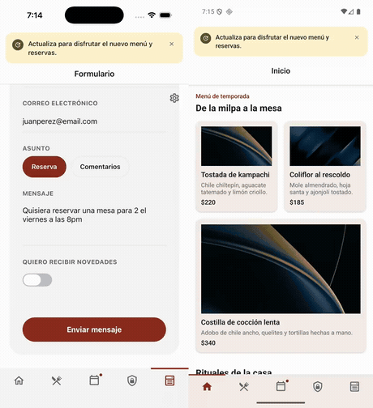
</p>

> 🎬 [Watch the MP4](docs/media/bonus.mp4) — iOS left, Android right, same flow.

| iOS glass | Android Material | Deep link (iOS) | Deep link (Android) | Mocked form (iOS) | Mocked form (Android) |
|:---:|:---:|:---:|:---:|:---:|:---:|
| 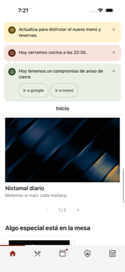 | 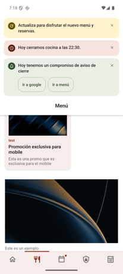 | 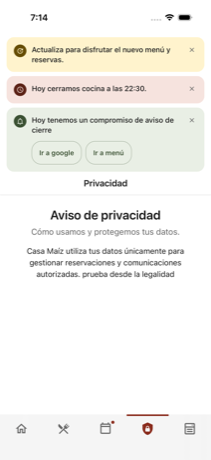 | 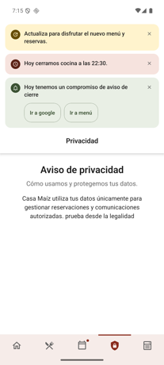 | 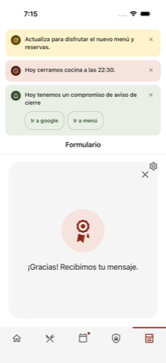 | 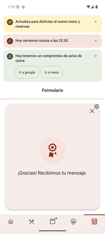 |

- **iOS glass** — a real `UIVisualEffectView` behind the tab bar
  (`presentation/ui/GlassSurface.tsx`); content stays legible as it scrolls
  under it, and the effect drops to an opaque surface under Reduce
  Transparency.
- **Android Material** — the same tab bar with tonal surfaces and elevation
  instead of blur, tonal cards, and ripple press feedback.
- **Deep links** — `xcrun simctl openurl booted casamaiz://legal/privacy_policy`
  (and the `adb` equivalent) routes through the same destination resolver the
  CMS uses, landing on the legal document fetched from `/legal/privacy_policy`.
- **Mocked form submission** — `formBlock` submits through a mocked network
  boundary and renders the CMS `confirmationMessage`. Nothing is written to the
  shared API unless `ENABLE_LIVE_FORM_SUBMISSIONS=true`.

### Feature flags gating navigation

`bootstrap.featureFlags.enable_new_home` gates the Reservations destination.
Same build, same CMS, flag flipped locally with
`FEATURE_FLAG_OVERRIDES=enable_new_home=false` — the destination is dropped
before the navigator is built, so the tab disappears with no per-screen
conditionals anywhere (`data/logic/featureFlags.ts`,
`navigation/TabNavigator.tsx`).

| `enable_new_home: true` | `enable_new_home: false` |
|:---:|:---:|
| 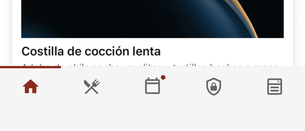 | 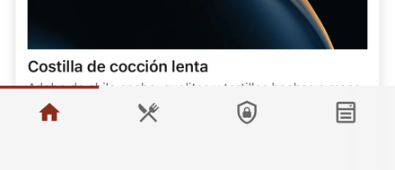 |

## Try it without building

[**Download the Android APK**](https://github.com/sjunka/casa-de-maiz/releases/latest) —
33 MB, arm64-v8a, JS bundled in, pointed at the published CMS. Signed with the
React Native debug keystore, so Android will warn about an unknown developer.

```sh
adb install casa-maiz-1.0.0-arm64.apk
```

## Quick start

Node 22, Xcode 26.5+ / Android Studio with a JDK 17.

```sh
cp .env.example .env          # API_BASE_URL defaults to the published deployment
npm install
```

**iOS** (one-time CocoaPods setup, then run):

```sh
bundle install && (cd ios && bundle exec pod install)
npm run ios
```

**Android** (emulator must already be running):

```sh
npm run android
```

Either command builds a debug app and starts it against the Metro dev server —
that's what a reviewer sees by default. For a release-mode build with the JS
bundled in, see the [prebuilt APK](docs/SETUP.md#prebuilt-android-apk) or
`docs/SETUP.md`. Physical devices, emulator networking and deep links:
[Setup](docs/SETUP.md).

## Quality

```sh
npm run typecheck && npm run lint && npm test
```

182 tests across 44 suites, plus 6 Maestro end-to-end flows covering offline
fallback, expired content, an unsupported contract version, navigation, a
CMS-published alert and a form submission. See [Testing](docs/TESTING.md).

## Known limitations

What was deliberately left out and why — five best-effort block types the
contract declares but never publishes a shape for, a placeholder Reservations
screen with no API behind it, performance instrumentation that stops at the
timing boundary, and no screen-reader pass. All of it, with the reasoning, in
[**Known limitations and next steps**](docs/LIMITATIONS.md).

## Docs

- [Architecture, trade-offs, dependency choices, types strategy](docs/ARCHITECTURE.md)
- [Setup: prerequisites, configuration, run commands, deep links](docs/SETUP.md)
- [Quality and testing](docs/TESTING.md)
- [Profiling and accessibility notes](docs/PROFILING.md) — measured startup, scroll and touch-target numbers
- [Production observability](docs/OBSERVABILITY.md)
- [Known limitations and next steps](docs/LIMITATIONS.md)
