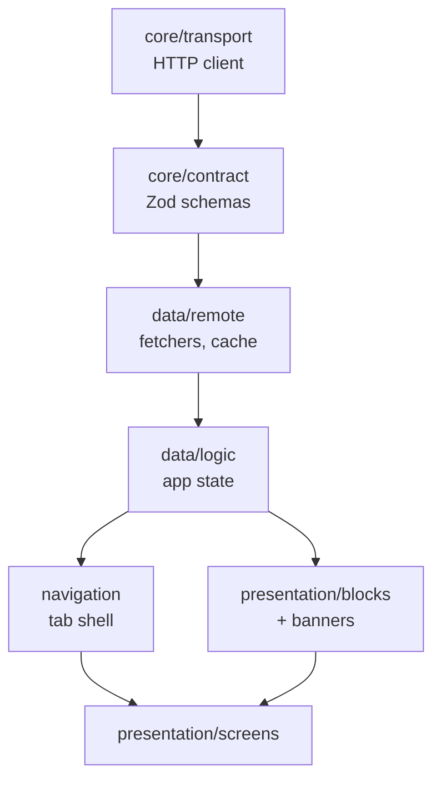

# Architecture

The app is organized around seven boundaries, screens composed on top:

- `src/core/transport` — HTTP client, error mapping, base-URL config
- `src/core/contract` — supported contract version, delivery-context construction, installed app version, and `src/core/contract/models` — Zod schemas and their inferred TypeScript types, grouped by what references what:
  - `models/primitives` — media, rich text, envelope, contract version — no dependency on any other model
  - `models/blocks` — the block union, depends on `primitives`
  - `models/bootstrap` — alert, promotion, operational controls — the pieces `bootstrap` assembles
  - `models/screens` — per-screen payloads (`home`, `menu`, `legalDocument`, `bootstrap`), depends on `blocks` and `bootstrap`
- `src/data/remote` — endpoint fetchers, query hooks, cache and freshness policy, query client:
  - `remote/fetchers` — one function per endpoint, returns validated data
  - `remote/hooks` — a `useQuery` wrapper per fetcher
  - `cache.ts`, `queryClient.ts` stay at the root — shared by every fetcher/hook
- `src/data/logic` — bootstrap-driven application state, no React, enforced by lint:
  - `logic/alerts` — alert selection, frequency policy, notice-source resolution
  - `logic/appUpdate` — version comparison and update decisioning
  - `featureFlags.ts`, `scrollProgress.ts` stay at the root — single-purpose, unrelated to either group
- `src/navigation` — destination resolution and the tab shell built from bootstrap:
  - `navigation/components` — the tab bar, tab icon, header title, tab navigator
  - `navigation/destinations` — destination resolution, deep linking, navigation ref
  - `types.ts` stays at the root — shared by both groups
- `src/presentation/blocks` — the block registry and block components
- `src/presentation/banners` — the alert banner, app-update gate and operational-notice banner
- `src/presentation/ui` / `src/presentation/theme` — shared presentation, tokens, dark mode, reduced motion
- `src/presentation/screens` — composition only; no screen talks to the network or cache directly

## Key trade-offs

- **Runtime validation over generated types**. The live API returns fields the public contract doesn't declare, so a generated client and hand validation would be two sources of truth that drift. Zod schemas describe only what the app consumes, tolerate additive fields, and infer TypeScript types with `z.infer` — one source of truth, and a malformed response is caught at the API boundary instead of deep in a component.
- **TanStack Query behind a thin repository, not a bespoke cache**. Query owns request lifecycle (dedupe, cancellation, refetch); the repository owns freshness policy — network-first, persisted last-good response served only on failure and always marked as saved, `nextChangeAt` as a hard expiry. Offline is derived from request failure rather than a connectivity library, since a reachable network with an unreachable API is the same user-facing situation.
- **One destination resolver, keyed on path, not per-surface routing**. Nav items, alert actions, and block CTAs all converge on the same resolver, so every tappable CMS link gets the same safety rules (`https`-only external links, user-safe messaging for unsupported destinations) for free.
- **Contract compatibility is major-equal, minor-greater-or-equal, checked twice**. The envelope is checked once; each block re-checks its own `contractVersion` and `channels` client-side even though the server already filters, so one incompatible block degrades without taking the page down.
- **Unknown blocks fail safe, not silent forever**. A block with no registry entry, a bad version, or an excluded channel renders nothing in release (logging only the `blockType`) and a visible marker in development — new blocks are additive, a registry entry rather than a screen rewrite.
- **No UI kit**. `StyleSheet` plus local design tokens, light/dark driven by system appearance, because a Material component library would impose Android conventions on iOS. The cost is presentation components written by hand instead of imported. Debug builds add an in-memory scheme override behind a gear in the dev-only form tab, so dark mode is reviewable without leaving the app.
- **A custom scheme through the existing resolver, not a second `linking` table**. `casamaiz://` deep links are stripped to a path and routed through the same `resolveDestination` every other tappable CMS link uses. Universal Links / Android App Links are out of scope — there's no domain the assessment lets us verify ownership of.

## Types strategy

Zod schemas, not generated OpenAPI types. Generated types give a compile-time shape with no runtime guarantee — a response that stops matching the contract still gets to the render path. The live API also returns fields the public OpenAPI contract doesn't declare, so a generated client and a hand-written validation layer would become two sources of truth that drift from each other over time. Zod schemas describe only the fields the app actually consumes, tolerate any additive field the contract doesn't promise, and TypeScript types are inferred straight from the schema with `z.infer` — one definition, checked at both compile time and at the API boundary at runtime.

## Dependencies

Every dependency added beyond the React Native CLI template, and why:

| Dependency | Why |
|---|---|
| `zod` | Runtime validation at the API boundary and the single source of truth for types. |
| `@tanstack/react-query` | Request de-duplication, cancellation of obsolete responses, and refetch/pull-to-refresh without hand-rolling them. |
| `@react-native-async-storage/async-storage` | Persists the last-good response for the offline fallback; the standard, officially-mocked choice for this. |
| `react-native-config` | Reads `API_BASE_URL` from `.env` per environment, so the base URL is configurable without editing code. |
| `react-native-device-info` | Reads the real installed app version for the `appVersion` delivery-context parameter, rather than trusting a source-file constant that can drift from the binary. |
| `@react-navigation/native`, `@react-navigation/bottom-tabs` | The tab shell is built at runtime from `bootstrap.navigation`; these provide native-feeling tab and stack navigation without writing a router. |
| `react-native-screens`, `react-native-safe-area-context` | Required peer dependencies of `@react-navigation` for native screen management and safe-area handling (notch, home indicator). |
| `react-native-reanimated`, `react-native-worklets` | Notice/banner transitions and the undo window run off the JS thread, and honour Reduce Motion. |
| `@shopify/flash-list` | Virtualizes the block list and long CMS form layouts. |
| `@react-native-community/blur` | The iOS translucent/glass treatment, gated on Reduce Transparency. |
| `@react-native-vector-icons/material-design-icons` | Tab and notice iconography; Material set on Android, same glyphs sized to iOS conventions. |
| `@sentry/react-native` | Native and JS crash reporting at the app root — see [Observability](OBSERVABILITY.md). |

No image library, connectivity library, or UI kit was added — each was considered and rejected in favour of a platform primitive or a documented deferral (see [Limitations](LIMITATIONS.md)).
