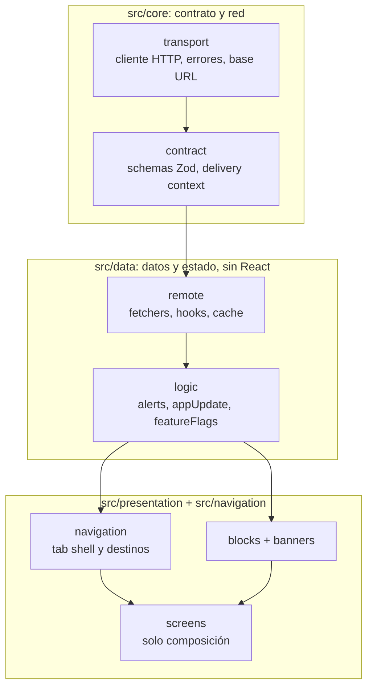
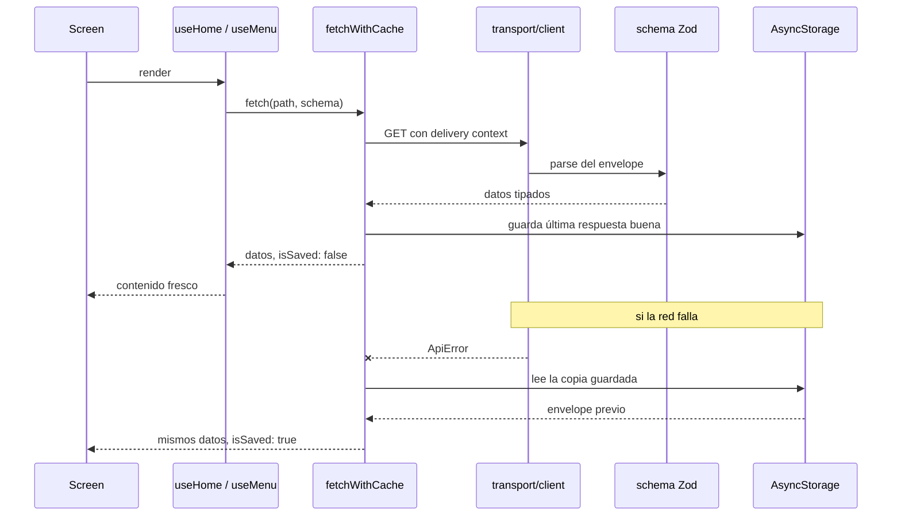
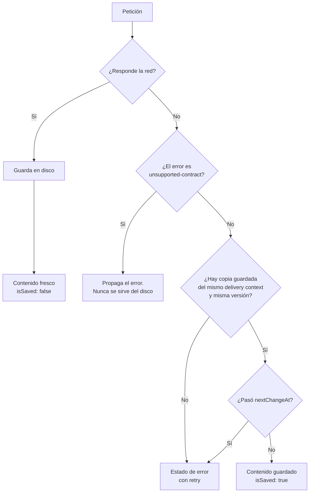
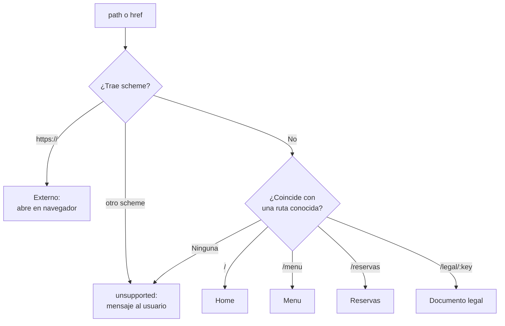
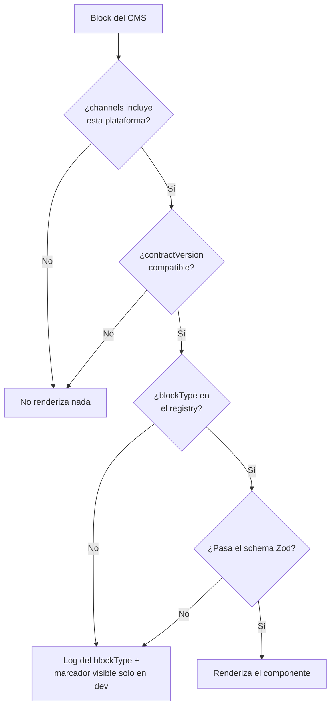

# Arquitectura

La app se organiza en siete fronteras, con las pantallas compuestas encima.
Cada flecha apunta en una sola dirección: nada de abajo conoce lo de arriba.

- `src/core/transport`: cliente HTTP, mapeo de errores, configuración de base URL.
- `src/core/contract`: versión de contrato soportada, construcción del delivery
  context, versión instalada de la app. Dentro, `src/core/contract/models`
  guarda los schemas Zod y sus tipos inferidos, agrupados por quién referencia
  a quién:
  - `models/primitives`: media, rich text, envelope, contract version. No
    dependen de ningún otro modelo.
  - `models/blocks`: la unión de blocks, depende de `primitives`.
  - `models/bootstrap`: alert, promotion, operational controls. Las piezas que
    `bootstrap` ensambla.
  - `models/screens`: payload por pantalla (`home`, `menu`, `legalDocument`,
    `bootstrap`), depende de `blocks` y `bootstrap`.
- `src/data/remote`: fetchers por endpoint, hooks de query, política de cache y
  frescura, query client.
  - `remote/fetchers`: una función por endpoint, devuelve datos ya validados.
  - `remote/hooks`: un wrapper de `useQuery` por fetcher.
  - `cache.ts` y `queryClient.ts` se quedan en la raíz, los comparten todos.
- `src/data/logic`: estado de aplicación derivado de bootstrap, sin React, y el
  lint lo obliga.
  - `logic/alerts`: selección de alerta, política de frecuencia, resolución de
    la fuente del aviso.
  - `logic/appUpdate`: comparación de versiones y decisión de actualizar.
  - `featureFlags.ts` y `scrollProgress.ts` viven en la raíz: cada uno hace una
    sola cosa y no pertenece a ninguno de los dos grupos.
- `src/navigation`: resolución de destinos y el tab shell construido desde
  bootstrap.
  - `navigation/components`: tab bar, ícono de tab, título de header, navigator.
  - `navigation/destinations`: resolución de destinos, deep linking, nav ref.
  - `types.ts` se queda en la raíz porque lo usan ambos grupos.
- `src/presentation/blocks`: el block registry y los componentes de block.
- `src/presentation/banners`: banner de alerta, update gate y aviso operativo.
- `src/presentation/ui` y `src/presentation/theme`: presentación compartida,
  tokens, dark mode, reduced motion.
- `src/presentation/screens`: solo composición. Ninguna pantalla habla con la
  red ni con el cache.

## El ciclo de una petición de contenido

Una pantalla nunca sabe de dónde salió lo que pinta. Pide datos al hook y
recibe contenido validado, más una bandera `isSaved` si viene del disco.

## Política de frescura

La regla es network-first. El disco solo entra cuando la red falla, y la copia
guardada caduca sola en `nextChangeAt`.

Un contrato incompatible nunca cae al disco: si el servidor cambió de forma, la
copia vieja es igual de inválida y mostrarla sería mentirle al usuario.

## Un solo resolver de destinos

Ítems de navegación, acciones de alerta, CTAs de block y deep links
`casamaiz://` pasan todos por la misma función. Las reglas de seguridad se
escriben una vez.

## Blocks que fallan seguro

El registry decide qué se pinta. Un block que no encaja se descarta solo, sin
tumbar la página.

Agregar un block nuevo es agregar una entrada al registry, no reescribir una
pantalla.

## Trade-offs principales

**Validación en runtime en vez de tipos generados.** La API viva devuelve
campos que el contrato público no declara. Un cliente generado más validación a
mano serían dos fuentes de verdad que se separan con el tiempo.

Los schemas Zod describen solo lo que la app consume, toleran campos
adicionales e infieren los tipos de TypeScript con `z.infer`. Una respuesta mal
formada se detecta en la frontera de la API, no dentro de un componente.

**TanStack Query detrás de un repositorio delgado, no un cache propio.** Query
se encarga del ciclo de vida de la petición: dedupe, cancelación, refetch.

El repositorio se encarga de la frescura: network-first, la última respuesta
buena servida solo ante un fallo y siempre marcada como guardada, y
`nextChangeAt` como expiración dura.

Offline se deriva del fallo de la petición, no de una librería de conectividad.
Una red alcanzable con una API caída es la misma situación para el usuario.

**Un resolver de destinos, indexado por path.** Nav items, acciones de alerta y
CTAs de block convergen en la misma función, así que cada link tappable del CMS
hereda las mismas reglas de seguridad sin costo extra.

**Compatibilidad de contrato: major igual, minor mayor o igual, verificada dos
veces.** El envelope se verifica una vez, y cada block revisa de nuevo su
propio `contractVersion` y sus `channels` en el cliente.

El servidor ya filtra, pero con la segunda revisión un block incompatible se
degrada solo en lugar de llevarse la página entera.

**Los blocks desconocidos fallan seguro, no en silencio para siempre.** Sin
entrada en el registry, con versión mala o canal excluido, el block no pinta
nada en release y solo registra su `blockType`. En desarrollo aparece un
marcador visible.

**Sin UI kit.** `StyleSheet` más tokens de diseño locales, light y dark según
la apariencia del sistema. Una librería de componentes Material impondría
convenciones de Android sobre iOS.

El costo es escribir los componentes de presentación a mano. Los builds de
debug agregan un override de esquema en memoria detrás del engrane de la
pestaña de formulario, para revisar dark mode sin salir de la app.

**Un scheme propio pasando por el resolver existente, no una segunda tabla de
`linking`.** Los deep links `casamaiz://` se reducen a un path y se enrutan por
el mismo `resolveDestination` que usa todo lo demás.

Universal Links y Android App Links quedan fuera de alcance: no hay un dominio
cuya propiedad el assessment nos permita verificar.

## Estrategia de tipos

Schemas Zod, no tipos generados de OpenAPI. Un tipo generado da forma en tiempo
de compilación y ninguna garantía en runtime: una respuesta que deja de cumplir
el contrato igual llega al render.

La API viva además devuelve campos que el contrato OpenAPI público no declara.
Un cliente generado y una capa de validación escrita a mano terminarían siendo
dos fuentes de verdad que se van separando.

Los schemas describen solo los campos que la app consume y toleran cualquier
campo adicional que el contrato no promete. Los tipos de TypeScript salen del
mismo schema con `z.infer`: una definición, verificada al compilar y en la
frontera de la API en runtime.

## Dependencias

Cada dependencia agregada más allá del template de React Native CLI, y para qué:

| Dependencia | Para qué |
|---|---|
| `zod` | Validación en runtime en la frontera de la API y fuente única de los tipos. |
| `@tanstack/react-query` | Dedupe de peticiones, cancelación de respuestas obsoletas, refetch y pull-to-refresh sin escribirlos a mano. |
| `@react-native-async-storage/async-storage` | Persiste la última respuesta buena para el fallback offline. Es la opción estándar y con mock oficial. |
| `react-native-config` | Lee `API_BASE_URL` del `.env` por ambiente, así la base URL se configura sin tocar código. |
| `react-native-device-info` | Lee la versión instalada real para el parámetro `appVersion`, en vez de confiar en una constante que se desfasa del binario. |
| `@react-navigation/native`, `@react-navigation/bottom-tabs` | El tab shell se arma en runtime desde `bootstrap.navigation`. Dan navegación nativa sin escribir un router. |
| `react-native-screens`, `react-native-safe-area-context` | Peer dependencies de `@react-navigation` para manejo nativo de pantallas y safe areas (notch, home indicator). |
| `react-native-reanimated`, `react-native-worklets` | Las transiciones de avisos y la ventana de undo corren fuera del hilo de JS y respetan Reduce Motion. |
| `@shopify/flash-list` | Virtualiza la lista de blocks y los formularios largos del CMS. |
| `@react-native-community/blur` | El tratamiento traslúcido de iOS, condicionado a Reduce Transparency. |
| `@react-native-vector-icons/material-design-icons` | Iconografía de tabs y avisos. Set Material en Android, mismos glifos ajustados a convenciones de iOS. |
| `@sentry/react-native` | Crash reporting nativo y de JS en la raíz de la app. Ver [Observabilidad](OBSERVABILITY.md). |

No se agregó librería de imágenes, de conectividad ni UI kit. Cada una se
consideró y se descartó a favor de una primitiva de la plataforma o de un
aplazamiento documentado (ver [Limitaciones](LIMITATIONS.md)).
